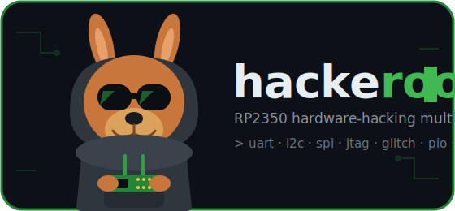

<p align="center">
  
</p>

# hackeroo

A hardware-hacking multitool firmware for the **Raspberry Pi Pico 2 (RP2350A)**.

It boots into a USB-serial command console exposing pluggable modules for the
kinds of things you do while reversing / bringing up / attacking embedded
targets: sniffing buses, dumping flash, probing pins, finding debug ports, and
injecting faults. It's built as a clean **boilerplate** — every module is a
small, self-contained, working example you can extend.

> ⚠️ **For authorized security research and work on hardware you own only.**
> The `glitch` module can permanently damage hardware. Read the safety notes.

Inspired by JTAGenum/JTAGulator, [BlueTag](https://github.com/koutto/bluetag),
[findus/PicoGlitcher](https://github.com/MKesenheimer/findus) and
[raiden-pico](https://github.com/AdamLaurie/raiden-pico).

---

## Modules

| cmd      | what it does |
|----------|--------------|
| `sys`    | chip id, clocks, temperature, reboot / reboot-to-BOOTSEL |
| `gpio`   | read / write / toggle / mode / scan / watch, **knight-rider `chase`** LED animation |
| `uart`   | **auto-baud detection**, passive sniffer, transparent bridge |
| `i2c`    | bus scanner, register read/write, block dump, **passive sniff** |
| `spi`    | raw SPI transfers + **25-series NOR flash** JEDEC-id / read / dump, **passive sniff** |
| `siggen` | PWM square wave, PWM-DAC waveforms (sine/tri/saw), DC level, ADC read |
| `pio`    | runtime-assembled PIO square-wave generator (PIO reference) |
| `jtag`   | **brute-force JTAG pinout** (IDCODE scan) + **SWD** pinout discovery |
| `glitch` | **PIO voltage/crowbar fault injection**: arm → trigger → delay → pulse |

Type `help` at the prompt for the list, and `<module> help` for details.

---

## Quick start

### 1. Flash

Plug the Pico 2 in while holding **BOOTSEL** (it mounts as a USB drive), then:

```bash
pio run -e pico2 -t upload      # build + flash via picotool
# or just build and drag-drop the UF2:
pio run -e pico2                # -> .pio/build/pico2/firmware.uf2
cp .pio/build/pico2/firmware.uf2 /run/media/$USER/RP2350/
```

Already running hackeroo? Just type `sys bootsel` to drop back into the
bootloader for reflashing.

### 2. Connect

```bash
pio device monitor -b 115200
# or: picocom -b 115200 /dev/ttyACM0
```

You'll get a banner and a `hackeroo>` prompt.

### 3. Use it

```
hackeroo> i2c scan
hackeroo> spi id
hackeroo> uart auto
hackeroo> jtag scan
hackeroo> glitch trigger manual
hackeroo> glitch set delay=2000 width=100
hackeroo> glitch arm
hackeroo> glitch fire
```

Long-running commands (scans, dumps, sniff, sweep) stop when you **press a key**.

---

## Default pin map

All pins are configurable per-command (`sda=`, `sck=`, `pin=`, `trig=`, …) and
default to the values in [`include/config.h`](include/config.h). Modules are
used one at a time, so some defaults overlap — just don't wire two active
functions to the same pin.

| function            | pin(s)            |
|---------------------|-------------------|
| UART TX / RX        | GP0 / GP1         |
| I2C SDA / SCL       | GP4 / GP5         |
| SPI SCK/MOSI/MISO/CS| GP18/19/16/17     |
| siggen out / ADC in | GP15 / GP26 (ADC0)|
| PIO demo out        | GP14              |
| JTAG/SWD channels   | GP6..GP13         |
| glitch trig/out/pwr | GP2 / GP3 / GP4   |

For **UART** wire the *target's TX* to our **RX (GP1)**. For **JTAG/SWD** wire
the unknown test points to any of the channel pins in any order — the scanner
brute-forces the roles.

---

## Module notes

### uart — auto-baud
`uart auto` times the narrowest pulse on the RX line (= one bit-time) while the
target transmits, then snaps to the nearest standard baud. **The target must be
sending data during the measurement** (reset it or trigger some output).
`uart sniff` monitors passively; `uart bridge` is a transparent pass-through
(exit with **Ctrl-]**).

### spi — flash dumping
`spi id` reads the JEDEC id and decodes the size; `spi dump` reads the whole
chip over the console (16 bytes/line hexdump). Works with standard 25-series
NOR flash (`0x9F` id, `0x03` read).

### jtag — pinout discovery
`jtag scan` permutes every channel over the TCK/TMS/TDI/TDO roles and reports
any assignment that shifts out a plausible IDCODE. `jtag swd` runs the
JTAG-to-SWD switch sequence and reads the DP IDCODE to find SWCLK/SWDIO. Slow,
brute-force, bit-banged — exactly like JTAGenum/BlueTag.

### glitch — fault injection
A PIO state machine gives jitter-free timing:

```
arm ─▶ wait(trigger) ─▶ delay(N cycles) ─▶ pulse(width cycles) ─▶ done
```

Timing is in **system-clock cycles** (1 cycle ≈ 6.67 ns @ 150 MHz). The output
(GP3) drives a **crowbar MOSFET** that briefly shorts the target's core rail
(or gates an external supply / EM injector). Triggers: `manual`, `rising`,
`falling`. `glitch sweep <start> <end> [step]` walks the delay to hunt for the
glitch window.

> 🛑 **Safety:** fault injection can brick or destroy hardware. Keep `glitch
> off` until wired correctly, only target devices you own, and never connect the
> crowbar output directly across a supply without the intended MOSFET.

**Boilerplate scope:** single pulse per trigger (re-armable) + delay sweep.
Multi-pulse bursts (COUNT/GAP), UART-byte triggering, and ADC depth-gating are
left as clearly-marked extension points — see raiden-pico for a full-featured
implementation.

---

## Power-on animation
On boot, hackeroo runs a fast knight-rider LED sweep across a configurable GPIO
range (great with a row of driver-backed LEDs). Point it at your LED pins via
`CFG_BOOTANIM_*` in [`include/config.h`](include/config.h), or set
`CFG_BOOTANIM_ENABLE 0` to disable. Trigger the same effect any time with
`gpio chase <first> <last> [ms]`.

## Host client library
[`client/hackeroo.py`](client/hackeroo.py) is a small pyserial wrapper that
parses the console output into Python values, so you can script tasks:

```python
from hackeroo import Hackeroo
hk = Hackeroo("/dev/ttyACM0")
print(hk.info())                     # {'chip_id': '8aaa...', 'sys_clk': 150000000, ...}
print([hex(a) for a in hk.i2c_scan()])
dump = hk.spi_read(0, 0x1000)        # bytes, auto-chunked
hk.glitch_config(delay=2000, width=120, trigger="rising"); hk.glitch_arm()
for d in range(1000, 5000, 10):      # a delay-sweep glitch campaign
    hk.glitch_set(delay=d); hk.glitch_fire()
```

## Tests
[`tests/run_tests.py`](tests/run_tests.py) is an on-target integration suite: it
flashes the freshly-built UF2, then drives every module's commands over serial
and asserts on the output (including regression tests for fixed bugs). Run:

```bash
pio run -e pico2                      # build first
python3 tests/run_tests.py            # flash + test  (add --no-flash to skip flashing)
```

## Extending it — add a module

1. Create `src/modules/mod_foo.cpp`:
   ```cpp
   #include "console.h"
   #include "util.h"
   static void foo_run(int argc, char** argv) { /* argv[0] = subcommand */ }
   static void foo_help() { Serial.println("foo — ..."); }
   extern const Module fooModule = { "foo", "one-liner", foo_run, foo_help };
   ```
   (Note the **`extern`** — namespace-scope `const` has internal linkage in C++
   without it, and the registry won't find your module.)
2. Declare it in [`include/modules.h`](include/modules.h): `extern const Module fooModule;`
3. Add `&fooModule` to `kModules[]` in [`src/modules/registry.cpp`](src/modules/registry.cpp).

That's it — `foo` and `foo help` now work.

---

## Build environments

- `pico2` — flash via UF2/picotool (default).
- `pico2_swd` — flash/debug over a CMSIS-DAP probe (`upload_protocol = cmsis-dap`).

## Known quirks
- The RP2350 on-chip **temperature sensor reads low / uncalibrated**; `sys temp`
  shows the raw ADC value so you can judge it yourself rather than trust a bogus
  absolute figure.

## Layout
```
platformio.ini        board + framework config (RP2350 via arduino-pico)
include/
  config.h            version + default pin map
  console.h           Module interface + console API
  util.h  modules.h   helpers + module externs
src/
  main.cpp            setup()/loop() -> console
  console.cpp         line editor, tokenizer, dispatcher
  util.cpp            parse/hexdump/arg helpers
  modules/            one .cpp per module + registry.cpp
```
